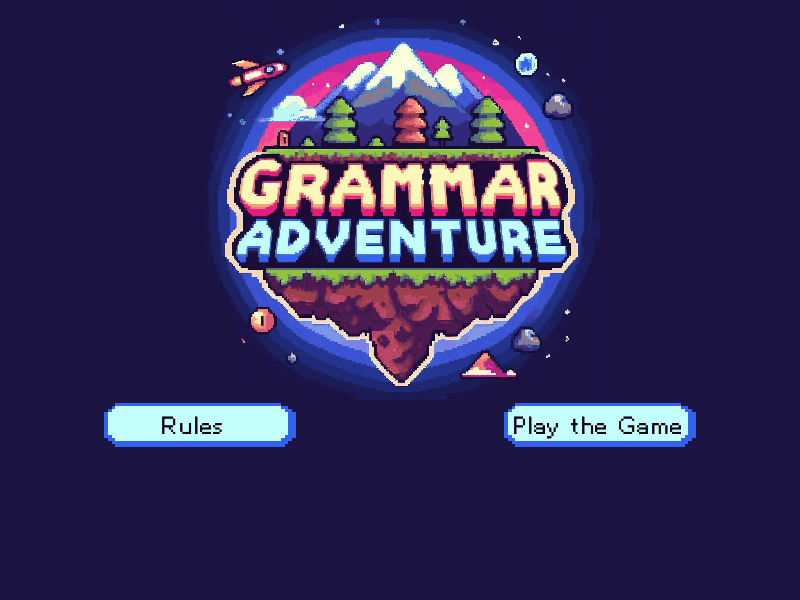
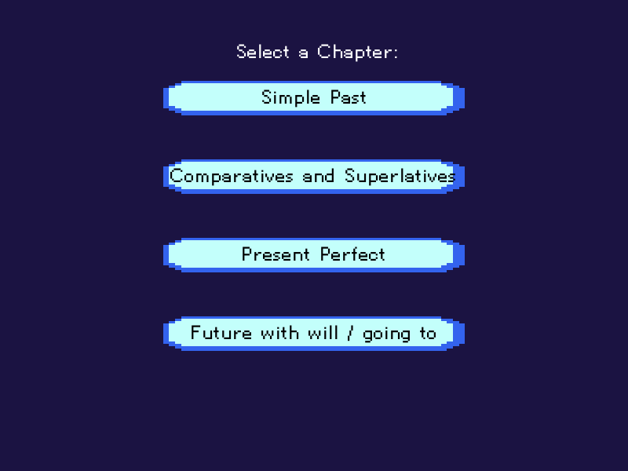
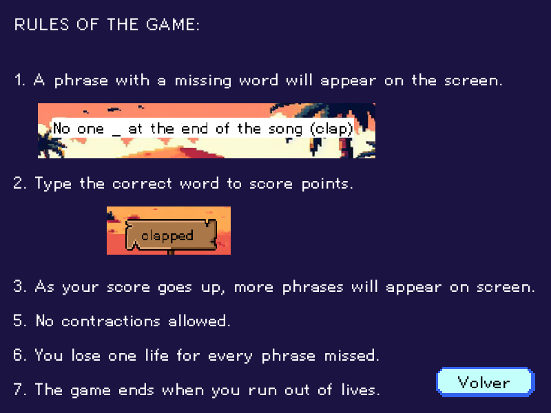
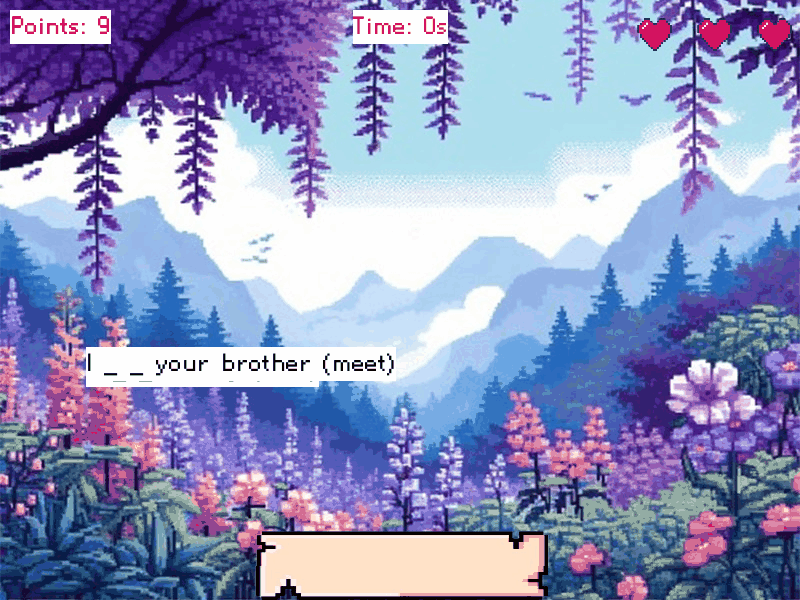
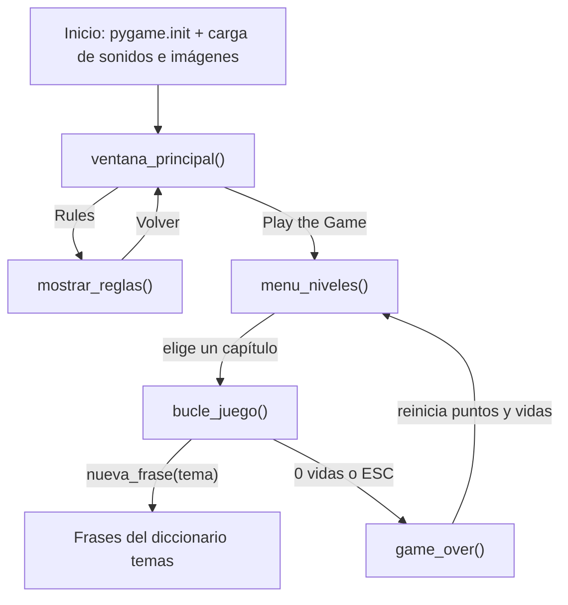

<div align="center">
  
  <h1>Grammar Adventure</h1>
  <p><b>Juego de escritura en pixel art para practicar gramática inglesa: completa la frase antes de que cruce la pantalla.</b></p>
  
  
  
  
  
  
  <p>
    <a href="#-inicio-rápido">Inicio rápido</a> ·
    <a href="#-características">Características</a> ·
    <a href="#-arquitectura">Arquitectura</a> ·
    <a href="#-pruebas">Pruebas</a> ·
    <a href="#-lo-que-todavía-no-existe">Limitaciones</a>
  </p>
</div>

**Grammar Adventure** es un juego de escritorio hecho con Python y pygame (800x600). Muestra frases en inglés con una
palabra (o varias) omitida que se desplazan de izquierda a derecha; el jugador escribe la respuesta y, si acierta, la
frase desaparece y suma un punto. Es un **prototipo educativo de un solo archivo**: no tiene menú de dificultad, guardado
de puntuaciones, tests ni instalador, y **solo funciona bien en Windows** (ver limitaciones).

## 🎬 Vista rápida

Capturas reales tomadas ejecutando el propio juego (renderizado sin ventana con `SDL_VIDEODRIVER=dummy`).

<div align="center">
  
  
  
  
</div>

## ✨ Características

| Característica | Detalle |
|---|---|
| 4 capítulos | Simple Past (31 frases), Comparatives and Superlatives (29), Present Perfect (28) y Future with will / going to (28): 116 frases en total, definidas en el diccionario `temas`. |
| Escritura libre | Se teclea la respuesta; al coincidir exactamente (sin distinguir mayúsculas) con la palabra esperada, la frase se elimina y se suma 1 punto. No hace falta pulsar Enter. |
| Dificultad progresiva | Velocidad `0.4 + puntuación/50` píxeles por fotograma y `puntuación // 8 + 1` frases simultáneas. |
| Vidas | 3 corazones; se pierde una por cada frase que sale por el borde derecho. |
| Sin repetición inmediata | `nueva_frase` evita repetir las últimas 10 frases mostradas. |
| Audio y arte | Música distinta por capítulo (`Stage1`-`Stage4.wav`), efectos de acierto/error, fondo pixel art por capítulo y fuentes TTF incluidas. |
| Extras de partida | Cronómetro (`Time:`) y puntuación visibles; `ESC` termina la partida y muestra "Game Over!". |

## 🏗️ Arquitectura

Todo el juego vive en `Grammar Adventure.py` (596 líneas) con estado global y una función por pantalla.



<details>
<summary>Estructura de carpetas</summary>

```
Grammar-Adventure/
├── Grammar Adventure.py        # Juego (versión de la raíz; fuente en Font/ relativa a la raíz)
├── Font/                       # Pixellettersfull-BnJ5.ttf y Pixelletters-RLm3.ttf
├── Material/                   # Copia de los recursos en la raíz (el juego NO la usa)
├── Grammar Adventure/          # Copia anidada: script + Font/ + Material/ (el juego lee de aquí)
├── docs/assets/logo.svg        # Logo del README
├── docs/screenshots/           # Capturas reales
└── LICENSE                     # MIT
```

El script de la raíz carga la música y las imágenes desde `Grammar Adventure/Material` y la fuente desde
`Font/` (ambas rutas relativas al directorio desde donde se ejecuta). Existe además una copia casi idéntica
dentro de `Grammar Adventure/` que usa `Grammar Adventure\Font\...` para la fuente.

</details>

## 🚀 Inicio rápido

| Requisito | Versión |
|---|---|
| Sistema | Windows (las rutas usan `\`; ver limitaciones) |
| Python | 3.x reciente (probado aquí con 3.14) |
| pygame | 2.x (probado con `pygame-ce` 2.5.7) |

1. Clona el repositorio (pesa ~100 MB por los `.wav` incluidos):
   ```bash
   git clone https://github.com/Luiss2080/Grammar-Adventure.git
   cd Grammar-Adventure
   ```
2. Instala pygame (no hay `requirements.txt`):
   ```bash
   pip install pygame
   ```
3. Ejecuta **desde la raíz del repositorio** (las rutas son relativas al directorio actual):
   ```bash
   python "Grammar Adventure.py"
   ```

Controles: ratón para los botones; teclado para escribir la respuesta; `Backspace` borra; `ESC` termina la partida.

## 🧪 Pruebas

No hay pruebas automáticas (badge de tests en 0 a propósito). Verificación manual realizada al preparar este README:
el script se importó y ejecutó con `SDL_VIDEODRIVER=dummy` y se renderizaron el menú, las reglas, la selección de
capítulos y un fotograma de partida, que son las capturas de arriba.

## 🔒 Seguridad

Es un juego local sin red, sin cuentas ni datos personales; no maneja secretos.

## 🚧 Lo que todavía no existe

- **Portabilidad**: la ruta de recursos (`"Grammar Adventure\Material"`) usa una barra invertida; en Linux/macOS los recursos no se encuentran. Python también avisa con `SyntaxWarning` por la secuencia `\M`.
- Debe ejecutarse desde la raíz del repo; en otro directorio falla al cargar fuentes/recursos.
- Sin guardado de récords ni puntuación máxima, sin multijugador, sin selección de dificultad.
- La respuesta debe coincidir exactamente: no acepta contracciones ni variantes válidas (p. ej. `won't`; hay que escribir `will not`).
- `ESC` no cierra el programa: termina la partida y lleva a "Game Over!", tras una espera fija de 6 s.
- Al quedarse sin vidas hay una pausa bloqueante de 4 s antes de la pantalla de fin; el juego no responde durante ese tiempo.
- Los botones de la interfaz están en inglés y "Volver" en español; las reglas numeran 1, 2, 3, 5, 6, 7 (falta el 4).
- Recursos duplicados (`Material/` y `Grammar Adventure/Material/`, más `Grammar Adventure.py` dos veces) y archivos sin uso (`mascota1-4.png`, `FondoPerfect.wav`, `pixel wood sign.avif`, `tempCodeRunnerFile.py`): el repo pesa ~100 MB, casi todo audio `.wav` sin comprimir.
- Sin tests, sin `requirements.txt`, sin CI, sin empaquetado (`.exe`).
- El README anterior mostraba una lista de "capturas" sin imágenes y decía que `ESC` "sale del juego"; ambas cosas se corrigieron aquí.

## 📄 Licencia

[MIT](LICENSE) — © 2026 Luis Rocha.

<div align="center">
  <sub>Hecho por Luiss2080 · Python + pygame</sub>
</div>
